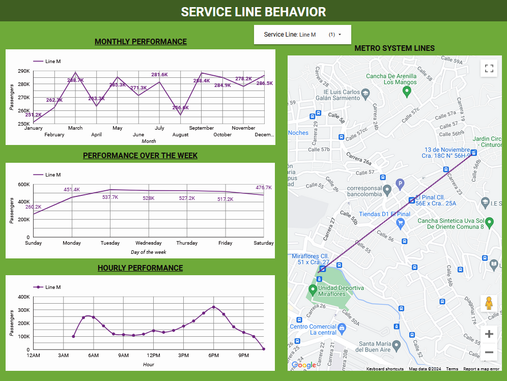

# Medellin Metro Performance

## Executive Summary:

Using Anaconda, Jupyter Notebook, Python, Looker Studio, BigQuery, and Google Cloud Shell; I imported public data from Medellin's Metro transit system, and conducted an exploratory study of each dataset and produced a dashboard that displays Metro's performance in 2023. Since the datasets have the same structure, affluence data from previous years that are available on Metro's official website can also be utilized on the preliminary data analysis developed with 2023 Affluence data. It was intended to generate Geospatial data and, with it, a geospatial visualization in Looker Studio using the exploratory data analysis performed for the dataset including the information of the metro system stations. For the year 2023, I determined which Metro lines were the busiest, as well as the "rush hours" for each line, the months, and the day of the week with the highest mobility.

### Business Problem: 

Assume you are a worker with a set schedule who makes use of the Medellin Metro to get to and from work. Every Tuesday and Thursday, you have the option of leaving or arriving an hour earlier or later than usual. You want to base your decision on how crowded the Metro line is. This project aims to address these issues and similars, in a way that any citizen can look for the information about the rush hour for any metro line, based on the day of the week, the month, or even for unusual dates. At a deeper level, the goal of this research is to predict how crowded a Metro line will be at a certain future date and time.

### Methodology: 

1. Collect Affluence data for 2023, and Metro system stations data; as a csv file.
2. Jupyter Notebook to import Affluence data for 2023, clean it, reshape it, and export it as "Affluence_2023.csv" file.
3. Jupyter Notebook to import Metro system stations data, clean it, crate a GeoDataFrame and export it as "Metro_lines_GeoInfo.geojson" file.
4. BigQuery to create a dataset named "Metro", and load the "Affluence_2023.csv" into a table.
5. Google Cloud Shell to Upload "Metro_lines_GeoInfo.geojson" dataset, convert it to a geoJSON-NL file, and load it into a table on the "Metro" dataset.
6. Looker Studio to connect data to BigQuery and build a dashboard that shows 2023 Metro Performance.

### Skills:

Python: Pandas, GeoPandas, Shapely, datetime, Writing functions, Reshaping data, Transforming data, Creating and Exporting DataFrames and GeoDataFrames, Converting data to GeoJSON format, Creating a Point(x,y) list, Creating geographic "linestring" data.

Anaconda: Launching Jupyter Notebook, facilitating an organized environment for data analysis.

Jupyter Notebooks: ".ipynb" files for EDA process using Python.

Looker Studio: Google Maps integration, Google Connectors, Line Map, Blending data, Creating report.

Google Cloud Shell: Converting a GeoJSON file to GeoJSON-NL data format, Uploading data files, Loading files into BigQuery.

BigQuery: Creating Dataset and Tables.

UML Diagram.

### Results & Business Recommendation: 

I created a DBMS Entity-Relationship Diagram (UML notation) to understand the data and their connections:

Now, let's take a look at the first page of our report:

We can draw the following conclusions:

- There were more than 300 million passengers mobilized in 2023.
- The busiest lines in the year 2023 were line A, line 1, and line B.
- The difference in the number of passengers mobilized between line A and the other lines is more than 600% of the number of the second or third busiest line (line 1 and line B).

Now, let's take a look of each line, on a specific level:

We can see that line A is the one that covers the longest distance, from Bello to Sabaneta, and has interconnection points with many of the other service lines. This explain the big gap it has, comparing with other service lines.

Filtering the data by line, we can see in detail how it behaves month by month, by day of the week, and even the hours of operation of the line and its peak hours.

**Line A:**

**Line 1:**

**Line B:**

**Line T:**

**Line K:**

**Line P:**

**Line 2:**

**Line J:**

**Line O:**

**Line M:**

**Line H:**

**Line L:**

I recommend a few adjustments:

- Optimize the way in which passenger flow data is documented, changing the format to facilitate its interpretation and analysis.
- In the “Affluence 2023” data, there is a line called T-A. After some research and comparing with other public data on the official Metro website, the "T-A line" is the same "T line", so it is recommended to modify this value, so that the information matches.
- A new row had to be added to the original data “Metro System Stations” with the values of the station Industriales line 1, but in direction A.
- Line L has some negative values. It was intended to leave those values, since I didn't have contact information from the Metro's analyst or Stakeholders.

### Next Steps:

1. Develop a Machine learning model to predict the behavior of users per line.
2. Gather more information about users per station with specific date and time, to solve questions about best routes, or faster ways to move around Bello, Medellin, Sabaneta, Envigado, and Itagüi.
